# greenwood-library-website

Install Git

Visit the official website [Git](https://git-scm.com/downloads) and download the version of git for your operating system.


## Capstone Project - Enhancing a Community Library Website

In this project, a simulation of how two team members contributed to a project will be shown. Morgan (Kzian), Jamie (Kzian), and cyb3rry

### Created branches and contributors

1. `main` - cyb3rry 
2. `add-book-review` - Morgan
3. `update-events` - Jamie


## Create a GitHub Repository

1. **Create a New Repository**:
   - On GitHub, click the "+" icon in the top-right corner and select "New repository".
   - Name the repository `greenwood-library-website`.
   - Optionally, add a description.
   - Choose "Public" or "Private" visibility.
   - Check the box to "Initialize this repository with a README".
   - Click "Create repository".


---
---

## Clone the Repository

1. **Copy the Repository URL**:
   - On the repository page, click the "Code" button.
   - Copy the HTTPS URL (e.g., `git clone https://github.com/cyb3rry/greenwood-library-website.git`).
    


2. **Clone the Repository Locally**: Each contributor (Morgan and Jamie) will do this
   - Open your terminal or command prompt.
   - Create a folder named `git-capstone-project` in your desired location:
     ```bash
     mkdir git-capstone-project
     ```


   - Navigate into 'git-capstone-project' folder 
     ```bash
     cd git-capstone-project
     ```

 
   - Clone the repository using the copied URL:
     ```bash
     git clone https://github.com/cyb3rry/greenwood-library-website.git
     ```

   - Navigate into the cloned repository
   ```bash
     cd greenwood-library-website
     ```


---

## Make Changes and Commit

1. **Create New Files**:
   - Create empty `About-Us.html`, `Events.html`, `Contact-Us.html`, `Home.html` files:
     ```bash
     touch About-Us.html
     touch Contact-Us.html
     touch Events.html
     touch Home.html
     ```
   - Add some contents to the files using a text editor or IDE.

   

   

2. **Check Git Status, Stage Changes, Commit changes, and push to Github**:
   - Run the following command to see the changes that have not been staged:
     ```bash
     git status
     git add .
     git commit -m "first commmit"
     git push origin main
     ```
3. **Verify on GitHub**:
   - Go to your repository on GitHub and verify that the html files have been added.


---

# PART 2: Simulating Morgan and Jamie's Work

This section shows the steps Morgan and Jamie took to contribute to the project already created by cyb3rry.

---

### To begin, Morgan and Jamie would create a separate branch each, send out a pull request, and merge with the original branch so that their changes would reflect.

### Simulating Morgan's Contribution

#### Steps:
1. **Navigate to the project directory** you just cloned using the command:
   ```bash
   cd greenwood-library-website
   ```

2. **Create a new branch called `add-book-review`:**
        
Before creating a branch, pull to be sure you are working with the recent work:
```bash
git pull origin main
```
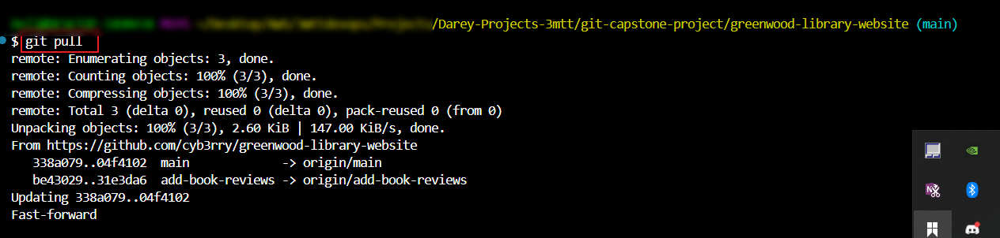

   ```bash
   git checkout -b add-book-review
   ```


   Push the branch to github
   ```bash
   git push origin add-book-reviews
   ```


3. **Verify pull request**: go to github and verify that the pull request went through. After that, compare and pull request, create pull request, and merge pull request.

Morgan's compare and pull
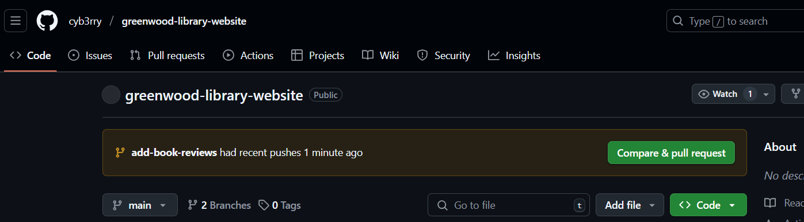
Reviewer added
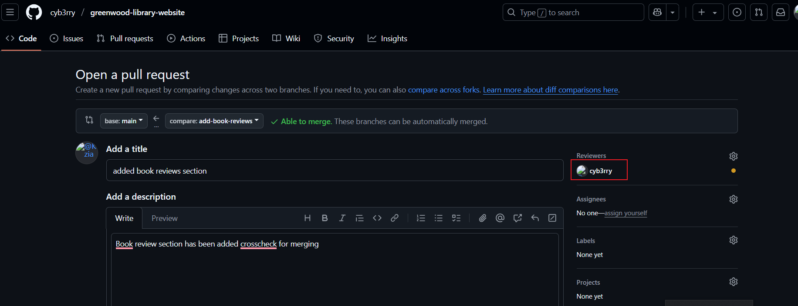
Ready to be reviewed
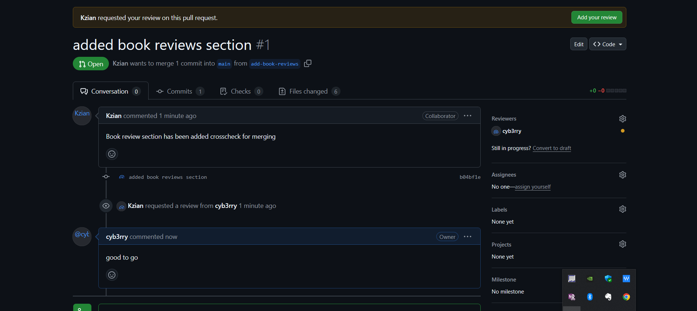
Reviewed
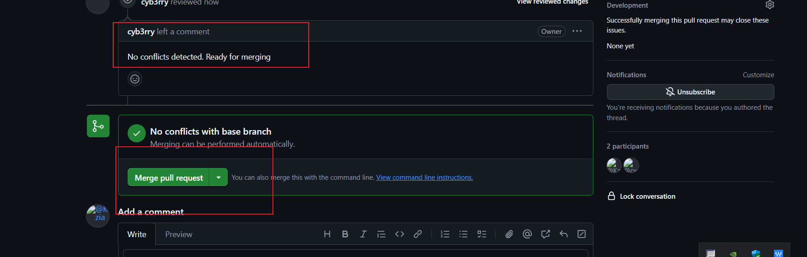
Merged
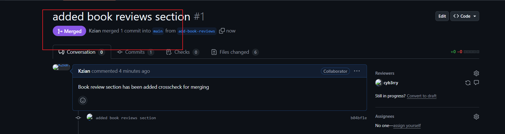


---

### Simulating Jamie's Contribution

### Steps:
1. **Switch back to the main branch**:
   ```bash
   git checkout main
   ```
   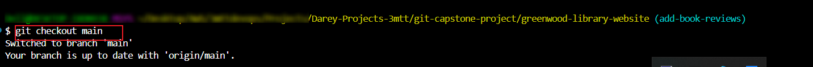

2. **Create a new branch for Jamie called `update-events`:**; Make the necessary changes to the project (e.g., include upcoming events`).

Before creating a branch, pull to be sure you are working with the recent work:
```bash
git pull origin main
```


   ```bash
   git checkout -b update-events
   ```
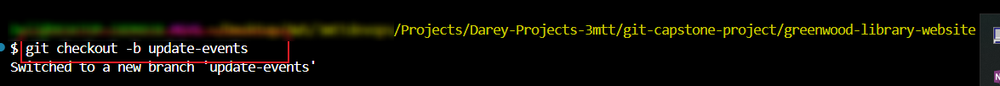

Push the branch to github
   ```bash
   git push origin update-events
   ```
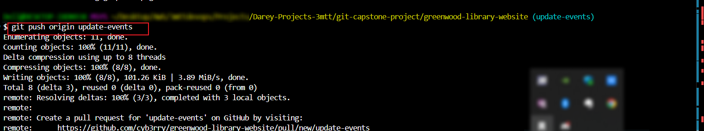

3. **Verify pull request**: go to github and verify that the pull request went through. After that, compare and pull request, create pull request, and merge pull request.

Jamie's compare and pull
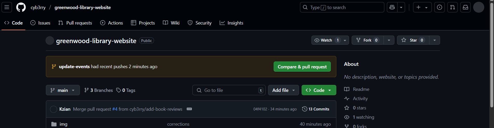
    Kzian's PR: goes to Morgan's branch to raise a pr
    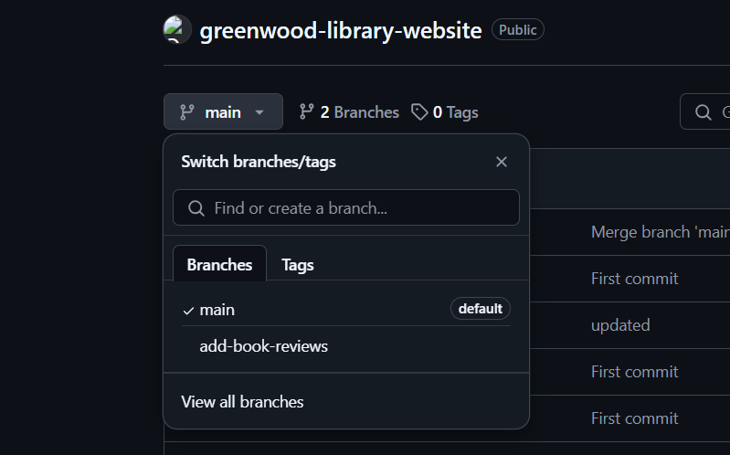
    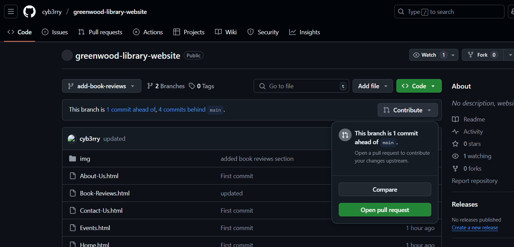
    On creating the pr, a conflict was noticed
    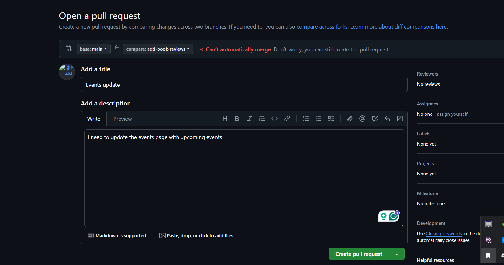
    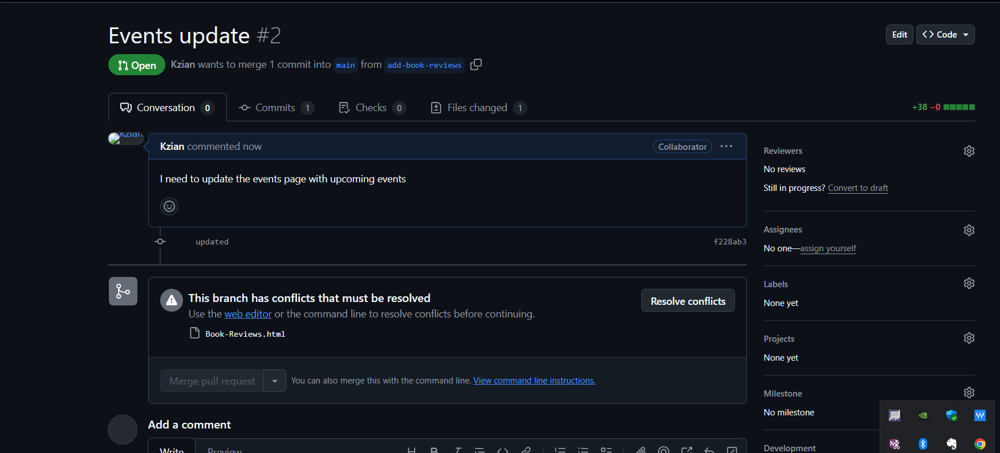
    Ongoing review
    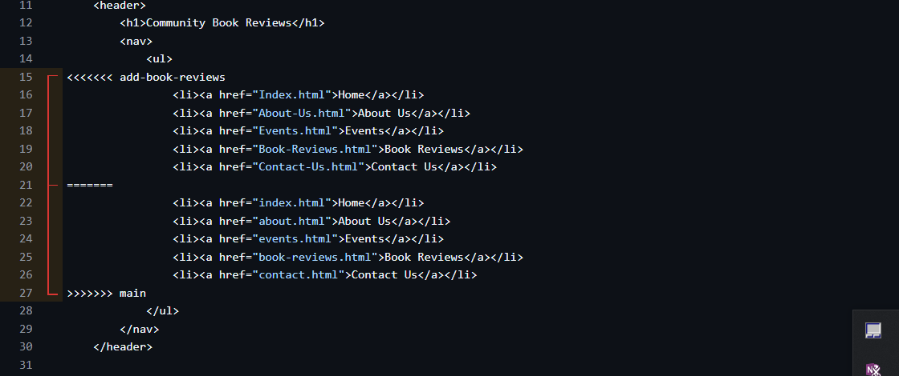
    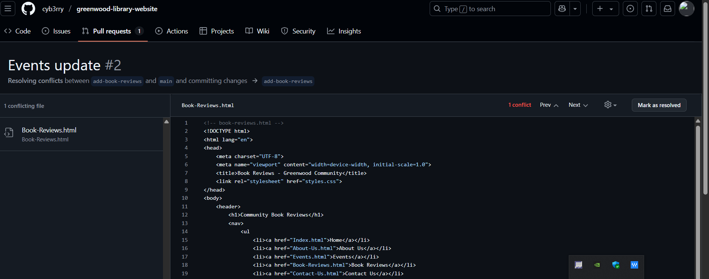
    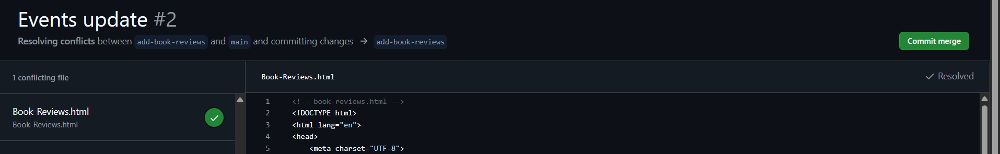
    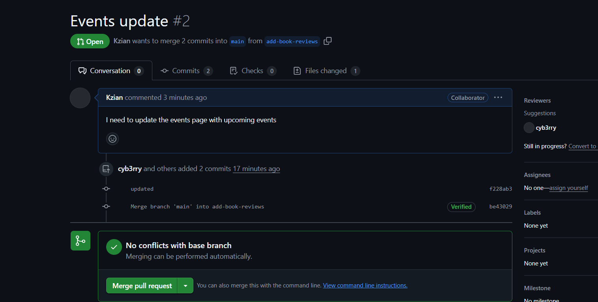
    Merged
    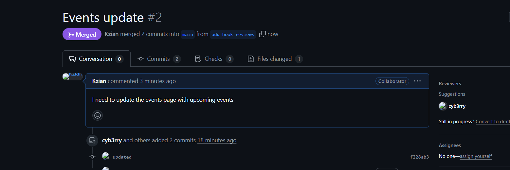

Ready to be reviewed
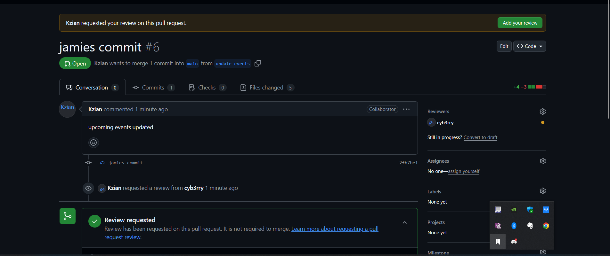
Ongoing review2
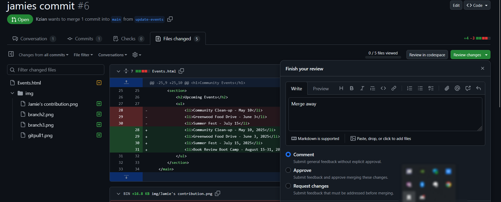
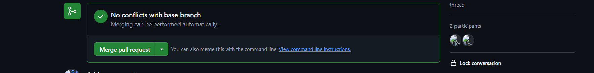
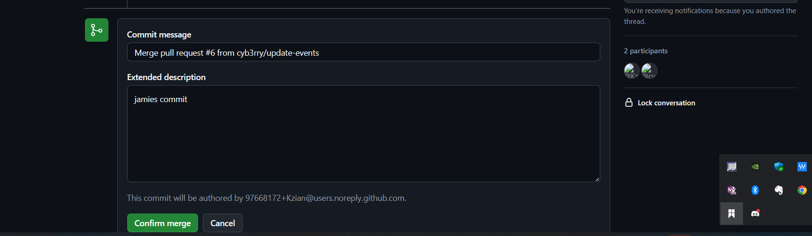
Merged (Final)
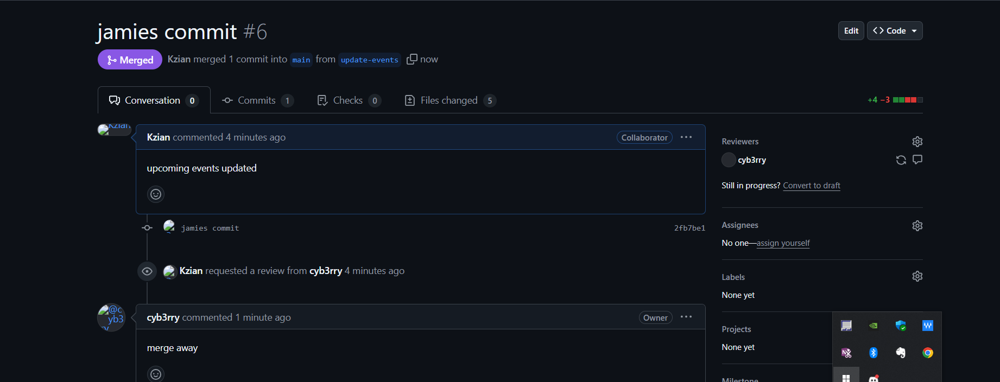


Switch back to main branch and pull

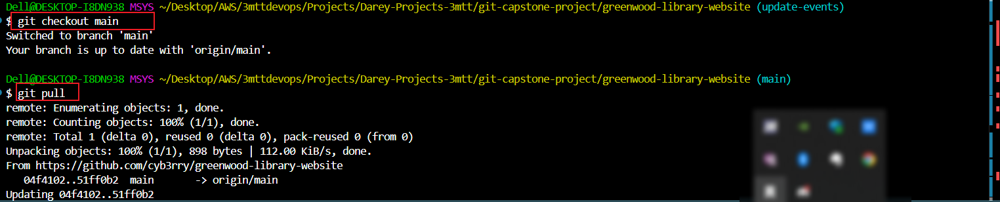
---

### Final verification on github

[Github](https://github.com/cyb3rry/greenwood-library-website)


## All contributors' updates were successfully merged with the main branch.


